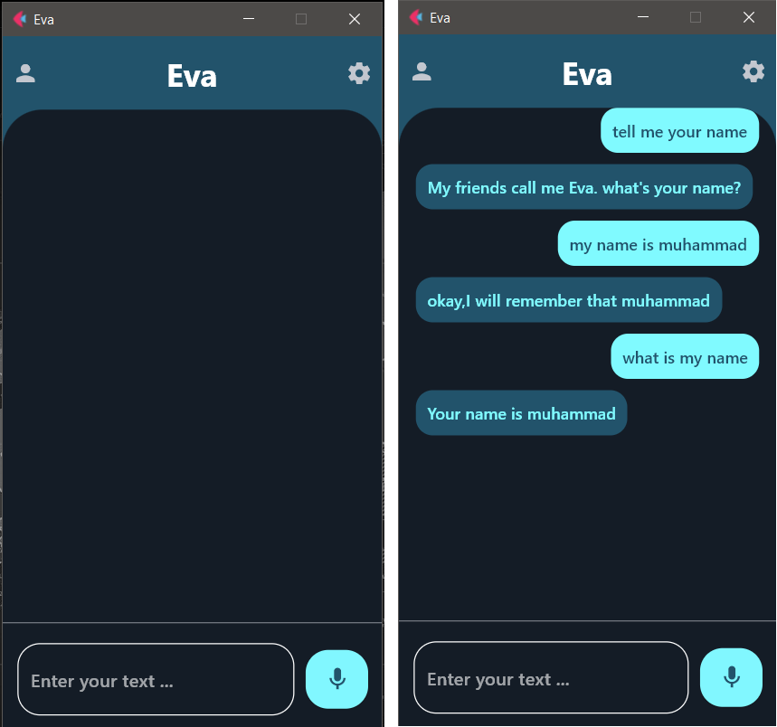

<h1 align="center[README.md](..%2F..%2F2.The%20University%20projects%2F3.CardID%20%28GUI%29%2F1.Python%20Scripts%2FREADME.md)">Voice Assistant</h1>
<hr/>



<p align="center">
    <a href="https://github.com/MohamadAboud">  </a>
    <a href="#">  </a>
    <a href="#">  </a>
    <a href="https://github.com/MohamadAboud/Voice-Assistant-GUI">  </a>     
    <a href="https://www.python.org/downloads/release/python-391/">  </a>
</p>

This is a simple graphical user interface (GUI) for a voice assistant built using the following libraries:

1. `flet`: a lightweight Python library for creating GUI applications.
2. `pyttsx3`: a Python library for text-to-speech synthesis.
3. `speech recognition`: a Python library for speech recognition.
4. `pyaudio`: a Python library for working with audio.

## Getting started
To use this `voice assistant GUI`, you will need to have the following dependencies installed on your machine:

### Prerequisites
* `Python`: This is the programming language in which the voice assistant GUI software is written. You can download and install Python from [here](https://www.python.org/downloads/release/python-391/).


 ```
 > python --version
 Python 3.9.1
 ```

### Requisites

* `flet`...
``` 
> pip install flet==0.3.2
```

* `pyttsx3`...
``` 
> pip install pyttsx3==2.90
```

* `SpeechRecognition`...
``` 
> pip install SpeechRecognition==3.9.0
```

* `PyAudio`...
``` 
> pip install PyAudio==0.2.13
```
 
<strong> Or you can download all libraries via the following command: </strong>

```
> pip install -r requirements.txt
```

## Using the voice assistant GUI
To use the voice assistant GUI, simply click on the "Start listening" button and speak your command into the microphone. The voice assistant will respond with the appropriate action.

Some examples of commands that the voice assistant can understand are:

* "What is the weather today?"
* "Tell me a joke"
* "Open YouTube"

The voice assistant is still in development, so it may not be able to understand all commands. If it does not understand a command, it will let you know and ask if you would like to try again.

## Contributing
If you are interested in contributing to the development of this voice assistant GUI, please feel free to fork this repository and submit a pull request.

## References
To learn more about the FaceAB software and its capabilities, please see the following references:

- `Mohamad Aboud's` profile: https://github.com/MohamadAboud

* `Flet`:
    * Flet documentation: https://flet.dev/docs/
    * Flet tutorial: https://flet.dev/docs/tutorials
    * Flet GitHub repository: https://github.com/flet-dev/flet


* `Pyttsx3`:
    * Pyttsx3 documentation: https://pyttsx3.readthedocs.io/en/latest/
    * Pyttsx3 GitHub repository: https://github.com/nateshmbhat/pyttsx3


* `Speech-Recognition`:
    * Speech-Recognition documentation: https://pypi.org/project/SpeechRecognition/
    * Speech-Recognition GitHub repository: https://github.com/Uberi/speech_recognition


* `PyAudio`:
    * PyAudio documentation: https://people.csail.mit.edu/hubert/pyaudio/docs/

These references provide more detailed information about the `voice assistant GUI` software, its capabilities, and its underlying technologies.
